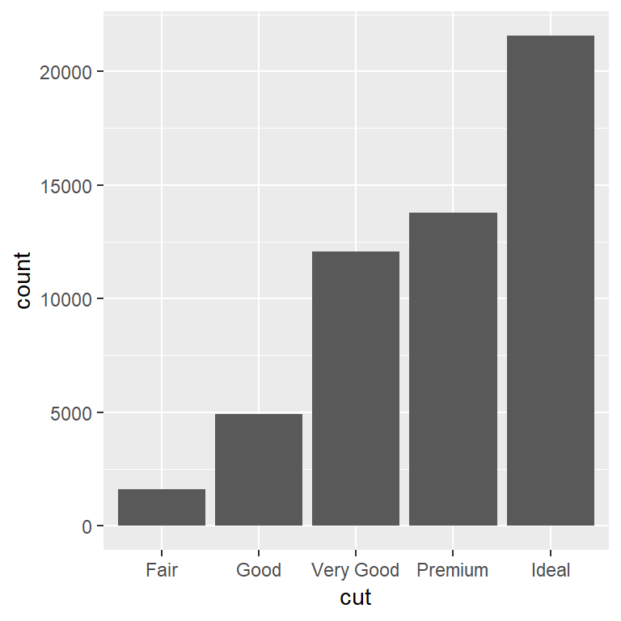
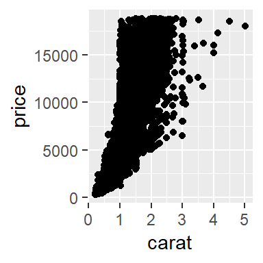
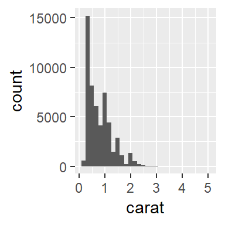
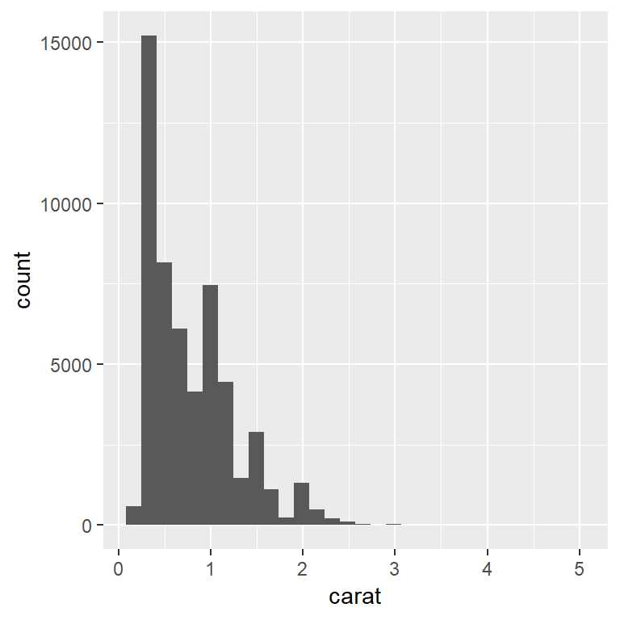
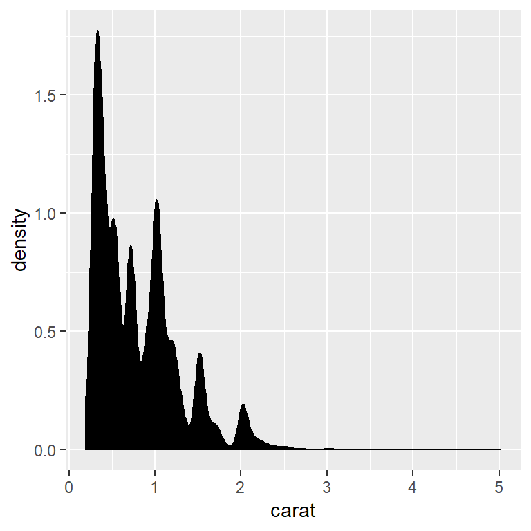
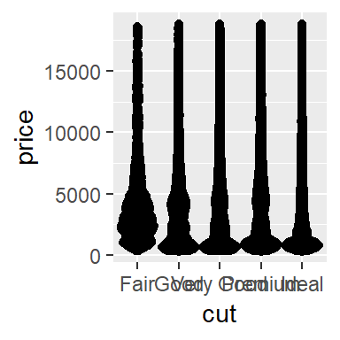
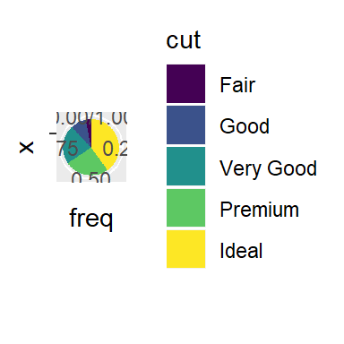
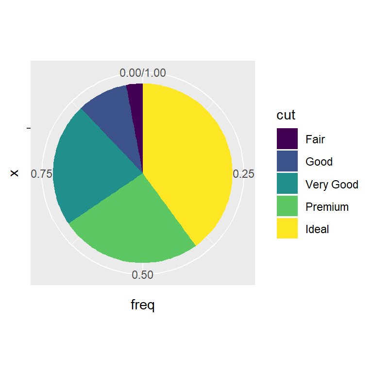
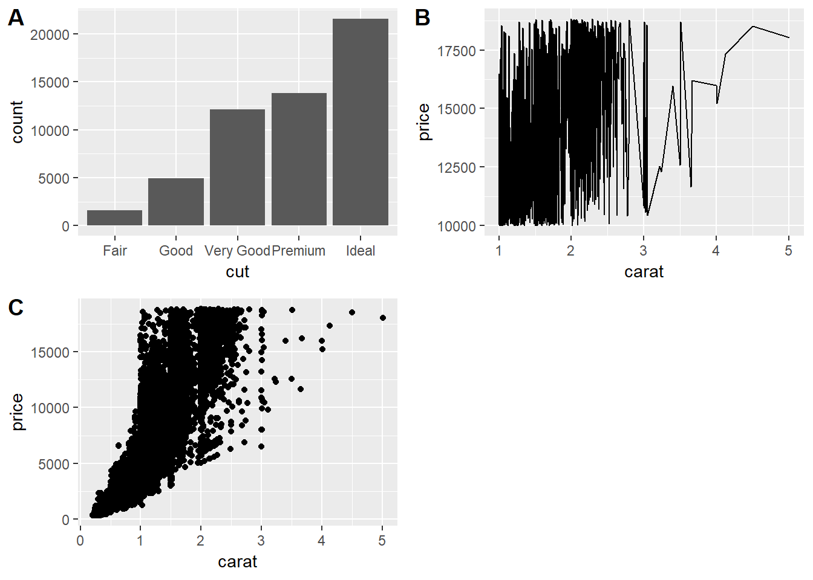

This document demonstrates how to implement and plot different chart types and chart combinations using minCombinR. It will be using the classic tabular diamonds dataset that is built into R. This document assumes that you have already run the "Getting started with minCombinR".


## Common statistical charts


```r
# Let's specify and plot some single charts.

# Bar chart:
bar_chart <- specify_single(chart_type = "bar", data = "diamonds", x = "cut")
plot(bar_chart)
```

```
## [1] FALSE
```



```r
# Line chart:
diamonds_GT_10000 <- diamonds %>%
  filter(price > 10000)
line_chart <- specify_single(chart_type = "line", data = "diamonds_GT_10000", x = "carat", y = "price")
plot(line_chart)
```

```
## [1] FALSE
```



```r
# Scatter plot:
scatter_chart <- specify_single(chart_type = "scatter", data = "diamonds", x = "carat", y = "price")
plot(scatter_chart)
```

```
## [1] FALSE
```



```r
# Histogram:
histogram_chart <- specify_single(chart_type = "histogram", data = "diamonds", x = "carat")
plot(histogram_chart)
```

```
## [1] FALSE
```



```r
# Probability Density Function (PDF) plot:
pdf_chart <- specify_single(chart_type = "pdf", data = "diamonds", x = "carat")
plot(pdf_chart)
```

```
## [1] FALSE
```



```r
# Boxplot:
boxplot_chart <- specify_single(chart_type = "boxplot", data = "diamonds", x = "color", y = "price")
plot(boxplot_chart)
```

```
## [1] FALSE
```



```r
# Swarm plot:
swarmplot_chart <- specify_single(chart_type = "swarmplot", data = "diamonds", x = "color", y = "price")
plot(swarmplot_chart)
```

```
## [1] FALSE
```



```r
# We'll even let you make a pie chart:
pie_chart <- specify_single(chart_type = "pie", data = "diamonds", x = "cut")
plot(pie_chart)
```

```
## [1] FALSE
```



## Combinations

### Many Types General
Many types general can be used when you just want to put a bunch of plots together and there are no spatial or visual linkages between the plots themselves.


```r
# Specify that you want to combine the bar_chart, box plot, scatter_chart and swarmplot_chart
mg_combo <- specify_combination(combo_type = "unaligned", 
                                base_charts = c("bar_chart", "line_chart", "scatter_chart"))
# Now plot it!
plot(mg_combo)
```

```
## [1] FALSE
## [1] FALSE
## [1] FALSE
```



### Small Multiples
Small multiple charts are visually linked because they show the same underlying chart type while showing different subsets of the data. Another common name for this is facets.


